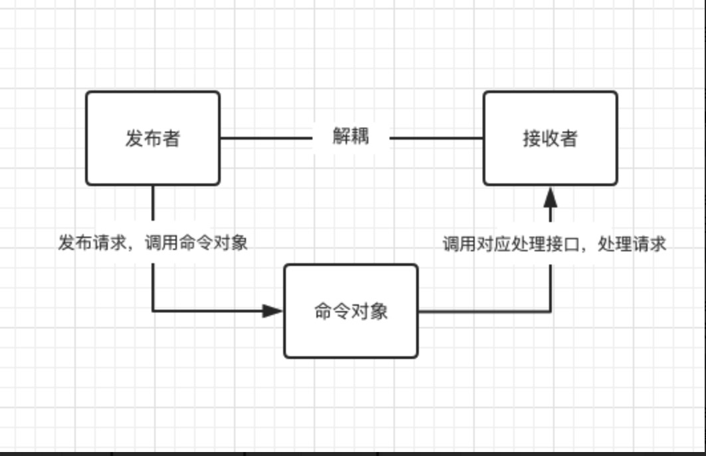

## 命令模式(Command Pattern)
### 1.定义
通过将**发出者**发出的请求封装成一个**命令对象**，然后由命令对象来与**接收者**直接交互。从而达到发出者和接收者之间的解耦。

### 2.生活实例
比如去饭店吃饭，顾客就是命令的发出者，顾客的订单就是一个命令对象，厨房就是接收者。顾客和厨房之间不会有任何的直接交互，通过命令对象这个中间对象来达到用餐的目的。

### 3.模式的特点
1. 发出者(sender) —— 发出命令，调用命令对象，不关心谁来执行
2. 命令对象(command) —— 接收命令，然后调用接收者的接口来处理这个命令
3. 接收者(reciever) —— 提供接口来处理命令，不关心命令从哪里来



### 4.使用命令模式的优点与缺点
#### 优点
1. 可以使发出者和接收者**解耦**
2. 命令对象的**生命周期很长**，内部包含了receiver对应的接口，可以在任意时间调用。
3. 使用命令对象的形式来管理请求，可以方便对请求**附加**其他的操作，比如，回撤、排队、延时和预定的功能。

#### 缺点
1. 额外增加命令对象，**非直接调用**，存在一定开销

### 5.代码示例
```js
const command=(receiver)=>{
  let cache={};
  return {
    // 初始预定
    book:(name)=>{
      cache=name;
      receiver.cook(cache);
    },
    // 加菜
    add:(foods)=>{
      Object.keys(foods).forEach((name)=>{
        if(cache[name]){
          cache[name] += foods[name];
        }else{
          cache[name] = foods[name];
        }
      });
      receiver.cook(cache);
    },
    // 取消某些菜，简单处理就是都可以取消
    undo:(foods)=>{
      Object.keys(foods).forEach((name)=>{
        if(cache[name]){
          cache[name] -= foods[name];
        }
      });
      receiver.cook(cache);
    }
  }
}

const sender=(command)=>{
  return {
    ...command
  }
}

const receiver=()=>{
  return {
    cook:(names)=>{
      let str = ''
      Object.keys(names).forEach((key)=>{
        str += ` ${key}*${names[key]},`
      })
      console.log('i will cook '+str);
    }
  }
}

const chufan = receiver();
const bookCommand = command(chufan);
const guest = sender(bookCommand);

guest.book({'tudou':1,'qiezi':2});
guest.add({'tudou':4,'lajiao':2});
guest.undo({'tudou':2,'qiezi':1});
```  

### 6.命令模式的应用场景
1. 在一些编辑器中，各种编辑的命令可以使用命名模式包装成一个个的命令对象，命令对象中需要缓存新老两份数据快照，然后把发出的命令对象放在一个**栈中缓存**起来，便于做**撤回**和**重做**的操作。


